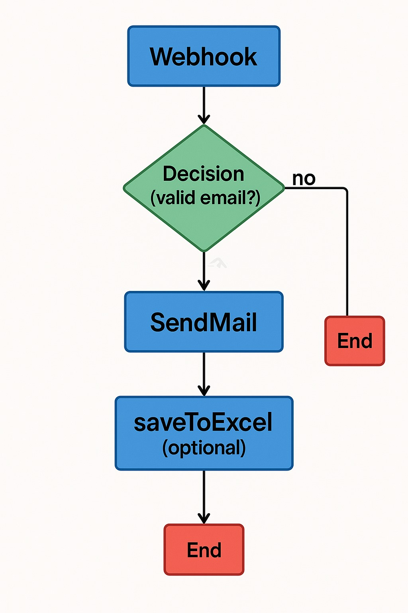

## Email de Bienvenida

Esta plantilla permite crear un flujo que se activa cuando un nuevo cliente se registra y automáticamente le envía un correo de bienvenida, opcionalmente guardando el evento en un fichero Excel o base de datos.

## Módulos utilizados

| Nodo         | Función                                                                 |
|--------------|-------------------------------------------------------------------------|
| `Webhook`    | Activa el flujo al recibir una petición externa                        |
| `Decision`   | Verifica si el dato recibido contiene email válido u otros filtros     |
| `SendMail`   | Envía un correo al usuario con contenido personalizado                 |
| `saveToExcel`| (opcional) Guarda los datos del nuevo usuario en un Excel              |
| `End`        | Finaliza el flujo                                                      |

## Descripción del flujo
1. Se recibe una solicitud externa desde un sistema externo o formulario web vía Webhook.
2. Se valida si los datos son correctos (por ejemplo, si el email no está vacío).
3. Si pasa la validación, se envía un correo personalizado.
4. Opcionalmente, se guarda una fila con los datos en un fichero Excel o base de datos.
5. Se cierra el flujo.

## Ejemplo visual del flujo

## Recomendaciones
- Asegúrate de tener configuradas las credenciales de envío de correo antes de probar.
- Revisa el formato del email y personaliza el cuerpo con variables dinámicas (`{{data.nombre}}`, etc.).
- Usa `saveToExcel` sólo si necesitas persistencia adicional para reportes.

## 🛠 Configuraciones típicas

### Nodo `Webhook`
- **url_webhook**: generado automáticamente por Floogos.

### Nodo `Decision`
- **condition**: `data.email && data.email.includes("@")`

### Nodo `SendMail`
- **to**: `{{data.email}}`
- **subject**: "¡Bienvenido a nuestra plataforma!"
- **body**: `Hola {{data.nombre}}, gracias por registrarte...`

### Nodo `saveToExcel` *(opcional)*
- **filePath**: `/documentos/nuevos_usuarios.xlsx`
- **dataKey**: `data`

## 🌍 Multiidioma
- Esta plantilla puede adaptarse fácilmente al idioma del usuario si `data.idioma` está disponible.

---
**Fin de plantilla**
